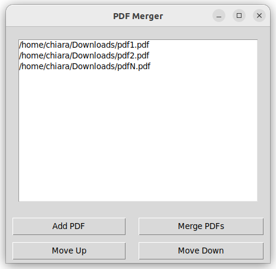

# PDFMerger

PDFMerger is a set of Python scripts that enable users to merge multiple PDF files into a single PDF document. This repository contains two versions of the tool: a command-line version for quick and easy merging, and a graphical user interface (GUI) version for a more interactive experience.

## Command-Line Version

The command-line version of PDFMerger is a simple script that takes in PDF file paths as arguments and merges them into a single PDF file. It's perfect for users who prefer working within a terminal or need to merge files quickly without a GUI.

### Usage

To use the command-line version, run the script with the PDF files you want to merge as arguments:

```
python pdfmerger.py
```

Then drag and drop the pdf files in the console and hit enter after each file.
Hit enter one last time when you have finished.
The script will ask you for the name of the output pdf file.

## Graphical User Interface (GUI) Version




The GUI version provides a user-friendly interface to add PDF files, arrange their order, and merge them. It's suitable for users who prefer a visual approach to file management.
### Features

- Add PDF files using the file dialog.
- Arrange the order of the PDFs with 'Move Up' and 'Move Down' buttons.
- Merge all added PDFs into a single document.

### Usage

Run the script without any arguments to open the GUI:

```
python pdfmerger_gui.py
```

Follow the on-screen prompts to add and arrange your PDF files, then merge them with a click of a button.

## Installation

To run PDFMerger, you need Python installed on your system. Additionally, you will need to install the required dependencies:

```
pip install -r requirements.txt
```

The requirements.txt file contains the following libraries:

```
PyPDF2
tkinter
```

Ensure you have these installed before running the scripts.